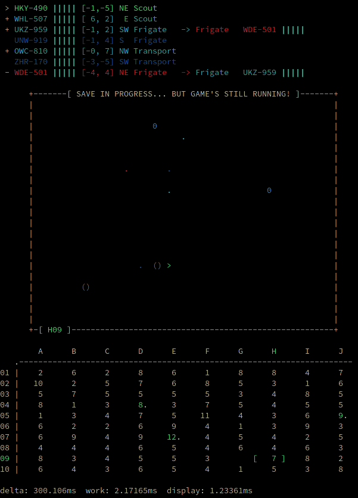

## Tiny Space

A small terminal-based space sim, originally intended as a base for testing features like real-time saves.
There are no controls. It's just a self-perpetuating sim. Quit with `Ctrl+C`.

Ships fly around, hopping sector-to-sector. Speed depends on ship class.
Displays in-sector ship information, a sector map, and a global map showing how many ships are in each sector.

This gist will remain a simple base, but may be updated with more features occasionally to increase complexity.
Separate gists will be created for versions and/or feature tests.

**Options:**
- `--color` - Enable color display (for terminals that support ANSI color codes)
- `--no-jumpgates` - Disable jumpgate travel and revert to the original fly-between-sectors style.

**Note:**
The `--no-jumpgates` option is currently broken, as ships will now always seek a destination.
Without jumpgates, that destination will always be a station or random location.
As such, they will never leave their sector.
This was an oversight and should be fixed in v4.

## What's New

**New in this version (v3):**
- Randomized jumpgate positions
- Added factions and player-owned ships
- Added stations, docking, and repair
- Added simple combat, a killscreen with timer, and automatic respawn in a new ship/location
- Separated single-file example into multiple files

## Sample Simulation



## ...or plain Black and White
```
 > AAD-198 ||||| [-4,-2]  W Corvette  -> Corvette  QVL-139 |
   HPR-860 ||||| [-6, 1] SW Transport
   PSH-086 ||||| [ 0, 0] NW Frigate  
 + XKQ-219 ||||| [-5, 1] SW Frigate  
   LNV-650 ||||| [ 6,-3] NW Scout    
 - SOC-853 ||||| [ 2, 1] NW Corvette 
 - QVL-139 |     [-1, 0] N  Corvette  -> Corvette  AAD-198 |||||

      +---------------------------------------------------------------+
      |                                                               |
      |                                                               |
      |                      0                                        |
      |                                                               |
      |                                                               |
      |                                                               |
      |                                                               |
      |                                                               |
      |                                                               |
      |             .  .                    .                         |
      |                            .  .                               |
      |                                                               |
      |             0     <                    ()                     |
      |                                                 .  0          |
      |                                           ()                  |
      |                                                               |
      |                                                               |
      |                                                               |
      |                                                               |
      |                                  0                            |
      |                                                               |
      +-[ F02 ]-------------------------------------------------------+

        A      B      C      D      E      F      G      H      I      J  
   .----------------------------------------------------------------------
01 |    6      2      1      4      7      3      3      4      3      4  
02 |    5.     5      9      6      4  [   8 ]    1      6             3  
03 |    6      4      7      4      5      7      5      4      6      2  
04 |    8.     6      3      3      3      3      5      5      8     10  
05 |    1      7     10      9      6      5      3      4      6      4  
06 |    3      1     11      6      7      7      5      5      2     10  
07 |    4      1      7      2      5      3      4      6.     4      9. 
08 |    4             4     10      1     10      4.     8      8      8  
09 |   13      2             4      2      6      5      6      3      4  
10 |    7      6      5      7     10             4      5      4      3  

delta: 300.093ms  work: 0.420654ms  display: 0.757988ms
```
